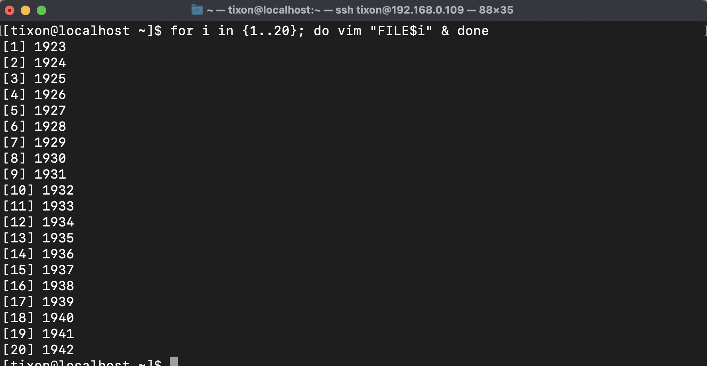
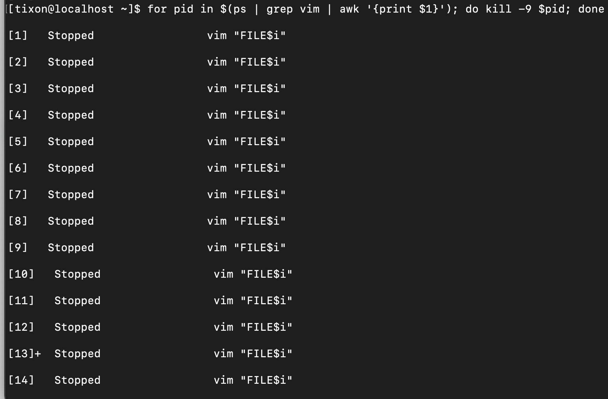

# Linux-tasks

## Task 3 - Write a simple parser script that uses 1 env variable;

Simple Parser
```
# Covert this - input file
a,b;c^d"e}
f;g,h!;i8j-

# To this - output file
a,b,c,d,e,f,g,h,i,j
```


## Task 4 - Try envsubst in vim (to change env variables to their values);


## Task 5 - Synchronize data form 1st Linux VM to 2nd Linux VM in the folder /home/<user>/myfolder every 5 minutes (install 2 VMs with Centos for this task). Try doing it with both rsync and scp.


## Task 6 - Create a situation where you have the following files open in Vim FILE1...FILE20. And put all files to sleep in the same bash instance. This will leave you with 20 Vim instances. Kill all files with pattern "FILE1" using a for loop. (see if you can do this in a single line).


