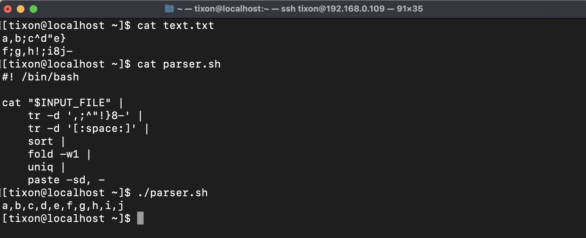
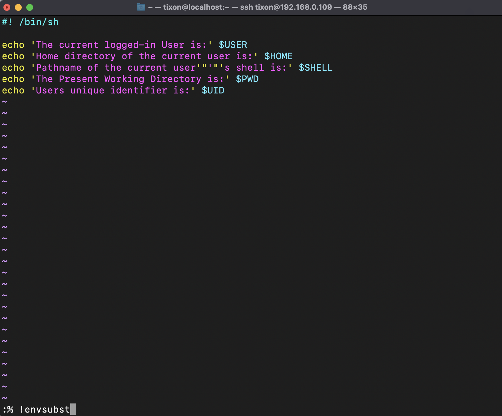
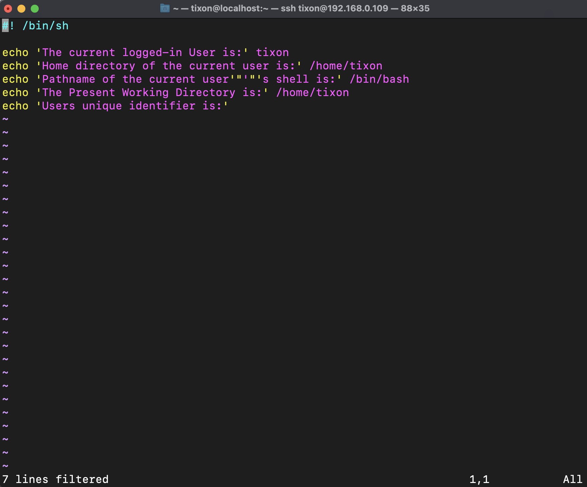
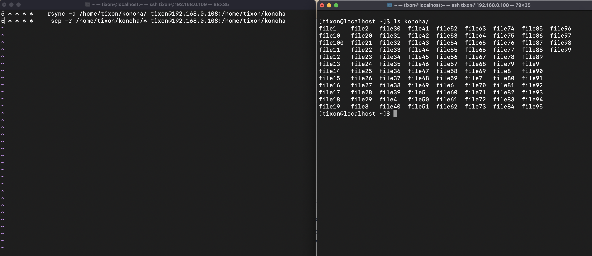

# Linux-tasks

## Task 3 - Write a simple parser script that uses 1 env variable;

Simple Parser
```
# Covert this - input file
a,b;c^d"e}
f;g,h!;i8j-

# To this - output file
a,b,c,d,e,f,g,h,i,j
```


## Task 4 - Try envsubst in vim (to change env variables to their values);




## Task 5 - Synchronize data form 1st Linux VM to 2nd Linux VM in the folder /home/<user>/myfolder every 5 minutes (install 2 VMs with Centos for this task). Try doing it with both rsync and scp.



